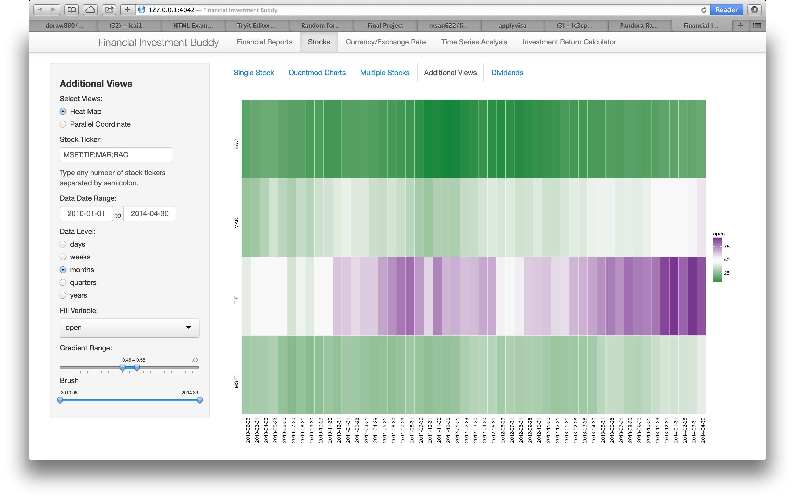
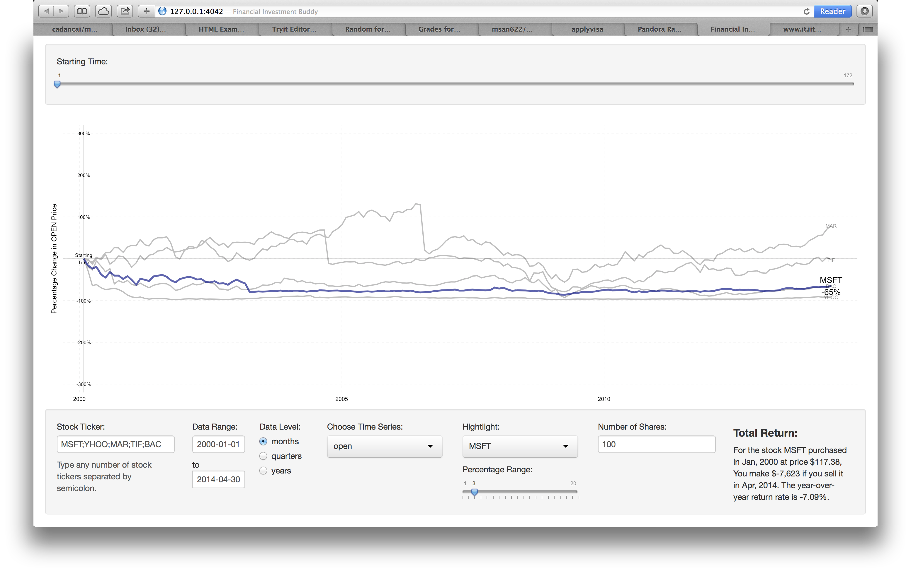

Final Project: Financial Investment Buddy
==============================

| **Name**  | Lee Cai  |
|----------:|:-------------|
| **Email** | lcai11@dons.usfca.edu |

Instructions
----------------------

The following packages must be installed prior to running this code:

- `ggplot2`
- `shiny`
- `reshape`
- `zoo`
- `plyr`
- `scales`
- `tseries`
- `forecast`
- `quantmod`


To run this code, please enter the following commands in R:

```
library(shiny)
shiny::runGitHub('msan622', 'cadancai', subdir='final-project')
```

This will start the `shiny` app. See below for details on how to interact with the visualization.

Discussion 
--------------------

## Overview

This shiny app is developed for people who want the most up to date information from the stock market. All the data is retrieved in real time from Yahoo Finance, Google, and OANDA. The app provides many different views to look at the stock price time series, as well as some deep analysis and prediction in time series. It attempts to provide a holistic view for potential investors to know more about the companies that they may be interested in putting in their hard earned money in hope of a more financially secured future. On this regard, a return calculator is also included. More details follows below.

## Interactivities

All interactivities created in subsections within each section are self-contained to that subsection. In the Financial Report section, the focus is on providing information on three different types of reports: balance sheet, cash flow statement, and income statement. From Google, we have both annual and quarterly reports. Users can choose to view either the full report, the key items on each report, or search for specific report item.

In the Stocks section, I focus on presenting the price time series. There are two major types of interactivities. The first type is the set of controls to specify what time series the user wants to look at. This includes the stock ticker, data date range, data level (daily, weekly, monthly, etc.) You can specify these items in all but the dividend tab, in which much smaller set of data, regardless of what data date range you want, is available because dividend is distributed very infrequently. In fact, the first type of interactivities is implemented across all sections. So I won't repeat them again below. The second type of controls is specific to each subsection. for example, in the single stock subsection, user can choose to include the any number of the four time series: open price, close price, low price, and high price. Since there are two components in this set of views, namely the overview and the detailed view of the chosen time series, users can control the level of zoom in on the detailed view. In the overview, users can play the animation to update the detailed view over time. the grey box corresponds to what is shown in the detialed view. More information will be provided in the coming section under "Sections".

The Currency Exchange Rate section is included because the information is available through R package quantmod. It is less unified with my entire theme of this shiny app. So you may treat it as a bonus. There are only two specific controls: choosing time series, and filtering. To zoom in, just choose the specific time range on the slider.

The Time Series Analysis section is more technical, and therefore to be able to understand what impact each interactivity will have on the visualization requires some understanding of the corresponding technique. I have included an embedded webpage to show more instruction on the techniques. User can check the "Display Instruction" checkbox to view this instructions. More details will be provided below.

Last but not least, we have the investment calculator. User can use this calculator to estimate how much return they would have received if they bought and sold their specific stocks on certain dates. Filter and Zooming are inplemented. To calculate the return of your investment, type the number of shares you have. The numbers will be displayed on the bottom right corner of the control panel.

## Prototype Feedback

Before I get into the challenges and some more details to my shiny app, here are some responses to the comments from my project prototype presentation peers. Charles was right. I was way too ambitious but eventually I have got it done beyond my own expectation. However, I did barely have enough time during my final project presentation, which I felt pretty bad. Instead of hastily walking through everything that I have done up to that time, I should choose to focus on one or two views as examples to show my classmates and professor what I was trying to do.

Charles caught all the NAs shown on the financial report during my prototype presentation. That was fixed now by using data table from shiny. Charles also had a very good suggestion in incorporating the ticker search functionality into each subsection. At the end I settle down with the 'Financial Reports/Overview of Stocks' subsection dedicated for ticker search. Not adopting Charles' idea is either because of time or laziness. A lot of things will have to be restructured to display the search results, plus I have to implement that search functionality on every subsection. When I play with the app myself, I do feel a bit trouble to figure out the ticker of the company I want. Still, give me some credit. You can still search for the ticker within my shiny app. Charles also thought that the information provided by the full report was too much. My answer is that it's not there to intimidate people. Rather, it's providing an option for people who want the full report. Real investment pros may want that. And still you have the options to look at only the key items or search for specific items from the reports. Other suggestions from Charles have been addressed in one way or another in the current app! Thanks Charles!

Katherine suggested that I should enable the comparisons among stocks in the same industry. In fact, this turns out to be easily achieveable. First, the user need to figure out what industry/category the main stock is in. Then go ahead and search for competitors' stock ticker within the same industry/category. Last, type in all these stock tickers in the stock ticker window. All corresponding time series will be downloaded from Yahoo Finance and visualized.

## Challenges

In the process of developing this shiny app, there were many expected/unexpected difficulties. I could have given up, and I am glad that I finally got it done. Let me discuss some of the challenges.

The first and utmost challenge is to develop the set of functions used for retrieving data from different data source using the quantmod R package. I have to fully master what is available from quantmod and which is the best way to retrieve certain data. It's a constantly rediscovering process. As I learned more, I went back to refine my code. After any number of time series are retrieved, I have to turn them into dataframe by merging different pieces of information together. One unexpected challenge lies in retrieving the currency data from OANDA. Every call made to OANDA only allows a maximum of 500 data points. To enable arbitrary data date range selection, I have to creatively stitch data from as many calls as needed to get the complete time series. Time series object is also more difficult to deal with in general because of more complex object structure.

The second challenge lies in writing code that accommodates all the possible scenarios given by the rich real time data. For example, all the data downloaded in real time has to be saved in reactive fashion. Depending on what data level the users choose (daily or monthly), all the models need to be able to automatically detect those options and do the right thing. How intelligent that need to be. Because of the variety of goals I tried to accomplish, the UI also becomes very complex and tedious. I have used just innumerable number of reactive UIs. These all added up to many hours of labor!

Last, this is truely a learning process. Not only have I collected external data, but I also did tons of reading. This includes learning to read the financial reports and reviewing some time series techniques. At the end I am so much better a time series expert! So my effort went way beyond the visualization and I am practically creating something potentially useful.

## Sections

There are five main sections. Each section has multiple subsections. All sections are designed to be independent so no interference will take place when used. Below I will provide summary of each section and its subsections with emphasis on what are unique in them.

### Financial Reports and Ticker Search

In this section, you can read three brief introductions in each of the three major financial reports: balance sheet, cash flow statement, and income statement. You can choose to view only key items on each of the three types of reports or search for specific items on a specific report, quarterly or annually. Full report is an option as well. Most importantly, the last subsection 'Overview of Stocks' provides the capabilities to search for desired currency and/or stock tickers. A interactive bar graph is also provided based on some external data I have collected. Nothing is too difficult for understanding the usage of this section. See the snap shots of the interface below.


### Stocks

In this section, there are five subsections. To focus on one single stock, use the Single Stock subsection. In addition to the time series view I created, I have also embedded the available quantmod plots, created by the chartSeries quantmod function. The most powerful thing about the quantmod plots is your ability to view all the financial indicators on the same time series graph. I don't understand most of them. So the downside is there is too much information, and for a general audience, the information is overwhelming. Again, it's only meant to be an option. Isn't it always better to have choice than not?


To compare across multiple stocks, use the Multiple Stocks subsection. There are two different views: small multiple time series, and bubble plot. I believe if I use 'Dark2' color brewer, type in too many tickers may prompt some errors in the bubble plot. The improvement is easy, but I will leave it as it is right now. A better informative name for the bubble plot is "fluctuation plot". This plot can provide you some interesting information about the fluctuation over time in the prices. Mind yourself though, there is a fourth dimension, that is the time dimension. Some stocks existed in a much later time, therefore if you only see some but not all bubbles, that's not a bug! That's because of set of stocks you picked have different availability.


Two additional views are provided to enrich the views. They are heat map and parallel coordinate plot. The heat map enable comparisons among different stocks over time in a different view. Color scheme and filtering are implemented for the heatmap. The parallel coordinate plot can be used to profile stocks at different time point. Grouping of stocks by a third dimension, brushing, and animation over time are available for interactivity.




Last, we have the dividend data available as well. It's displayed in a time series bar graph. Filtering is implemented in time range.


### Currency Exchange Rate

In this section, one can find the exchange rate between two currencies. Filtering is implemented. The usage is self-explanatory. I found that implementing Filtering has not only filtering, but also zooming effect on the graph. One can choose any number of time series out of the four: open price, close price, low price, and high price.


### Time Series Analysis and Prediction

The Time Series Analysis section is the most technically complex one. Three different time series techniques are implemented. They are Seasonal Trend Decomposition (STL), Exponential Smoothing, and Autoregressive Integrated Moving Average. All the visualizations are in the format of time series. All three of them try to provide a comprehensive modeling process of a time series analyst. Detailed description will be provided below on the interactivities that are available. For the technical details, check the checkbox to display instruction.

Let's start with the STL decomposition. The time series period control is highly dependent upon the data level. For example, if your data is at daily level, and the period you are after is weekly, then the period normally should be 7. If your data is at monthly level, and the period you are after is yearly, then the period normally should be 12. However you can set it to be any number between 2 and 24. Based on this period, the correponding time series will be decomposed to provide the seasonal component. Notice that the default view is on different scale on each of the four plots. Check the scale checkbox will provide you a consistent scale to view the same four plots. To triger the plot of time series that remove the seasonal component, check the remove seasonal checkbox. It's good to see the general trend overtime after removing the seasonal effect. Note that I didn't implement the lowess smoothing of the STL decomposition. Everything is done with the simple periodic decomposition. See the instruction for more information.


In the exponential smoothing model, the time series period has the same meaning as in the STL decomposition subsection. It's used to convert the time series into a ts object in R for use in the HoltWinters function in R. There are four different smoothing models: simple exponential, double exponential, seasonal exponential, and Holt-Winters. Choose the model with the smallest SSE. When seasonal exponential or Holt-Winters model is used, since the model has a seasonal component, one can choose between two further different type of model: additive, and multiplicative. Prediction and filtering are implemented. For predition, user can set how far into the future he/she wants the prediction to go and the confidence interval. The region indicates the confidnce area is visualized with a geom_ribbon in ggplot2. Check the display instruction for more information on exponential smoothing models. As a second view, a model residual plot is provided.


In the ARIMA model, in addition to the ability to choose all the parameters for specific models, I also provide some statistical tests, as well as the acf and pacf plots to help users choosing the right model. One can choose the lags for both the tests and the acf/pacf plots. All the model parameter orders are in your control as well. If you check the seasonal time series checkbox, the corresponding seasonal orders will be prompted. You will also have the option of implementing OLS detrending and Box-Cox transformation on the selected time series. Last, similar prediction and filtering functionalities have been implemented like I did in the exponential smoothing subsection. Check the display instruction for more information on arima models.


### Investment Calculator

As a closing, sometimes investors may want to calculate the returns given the number of shares they have, the date they purchase and sell their stocks. This investment calculator does just that. Type in the porfolio of stocks you have, select the time frame for the time series, and scroll the time to your first purchase date, then you will be able to see if you sell the highlighted stock at the chosen end date, how much you are going to make and what is the year-over-year return rate. The usage should be trivial to learn after playing around a little bit.



## Discussion on  Lie Factor, Data Density, and Data-ink Ratio

Due to the nature of my data (all temporal data), my data-ink ratio will be high. This is particularly true because I also make every effort to remove redundant pixels from the graphs. The size of the graphs are chosen so they fit in my 15 inch macbook pro screen. I am not sure what it will look like in PCs and other screen resolution ratio laptops. The lie factor should all be close to 1 because there is no data distortion. Almost all the graphs are reasonably dense. The quantmod chart, depending on how many financial indicators you choose, could be more dense than most other graphs. Heatmap for sure will have a lower data-ink ratio.

## Closure

Finally, the project is coming to an end. By adding a little bit at a time, I end up with this two thousand line worth of R code shiny app. A lot of data munging behind the scene. A number of sleepless night because I was getting too excited in solving the problems that I was facing. Due to the complexity and possibility of the data source I am using, there could be some hidden bugs or unexpected data problem. It's now the users to discover, and feedback will be highly appreciated. The next step, I am going to run a T1 micro on Amazon Web Service, install a shiny server there, and have this app alive for users to access and play around. The data visualization class gave me the opportunity to become proficient in using ggplot2 and shiny among other techniques. The project further improve my data munging skills. The ability to visualize data while doing analysis couldn't be more important.


