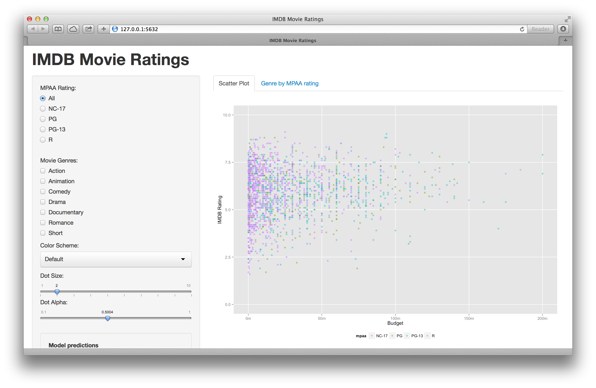

Homework 2: Interactivity
==============================

| **Name**  | Lee Cai  |
|----------:|:-------------|
| **Email** | lcai11@dons.usfca.edu |

Instructions
----------------------

The following packages must be installed prior to running this code:

- `ggplot2`
- `shiny`

To run this code, please enter the following commands in R:

```
library(shiny)
shiny::runGitHub('msan622', 'cadancai', subdir='homework2')
```

This will start the `shiny` app. See below for details on how to interact with the visualization.

Discussion 
--------------------

Below is a screenshot of the interface of the shiny app.



## Interaction Description

- This shiny app provides the basic interactions required by my dear professor.

  - Subset the data by choosing the MPAA rating. You can choose to include all ratings, or one of the four (NC-17, PG, PG-13, and R). By default, it is set to include all movies.
  
  - Subset the data by movie genre. You can choose any combination of the following genres: Action, Animation, Comedy, Drama, Documentary, Romance, and Short. By default, it is set to include all movies.
  
  - Choose your favorite color scheme. The available options are "Default", "Accent", "Set1", "Set2", "Set3", "Dark2", "Pastel1", "Pastel2", and "Color-Blind Friendly".
  
  - Adjust the dot size.
  
  - Adjust the transparency of the dots.
  
- When you choose any subset of the data in the scatter plot, the non-relevant movies will become very light in color and lurking in the background, which will provide viewer context of all movies to the movies you select. The selected movies will stand out with a dark blue color.

- Sometimes when there is no movie return from your selected combination of MPAA rating and genre, a scatter plot with all movies will remain in sight, but you will be reminded in the middle of the plot with the message "The is no movie in the selected combination of mpaa and genre. Please reselect!"

- In order to guide your selection, you can also switch to the second tab, which displays a two way contingency table of MPAA rating by genre. And you can see the counts in each combination of the two factors.

- There are two additional interactions you can play with. They are to display the output from fitting either a linear or quadratic regression line on the selected movies and add the fitted line to the scatter plot. 

  - When all movies are selected, the scatter plot will add four lines fitting to data in each MPAA rating. When only a subset of the movies are selected, the scatter plot will add only one fitted line to the selected movies.
  
  - Selecting the models will also triger conditional panel(s) under the scatter plot to display a summary of the model fitting.
  
  - If there are no movies from the selected combination of MPAA rating and genre, a text "There is no data." will be displayed instead.
  
  - Note that when both models are selected, the fitted line are differentiated by the line types: dotdashed lines for linear regression, and dashed lines for quadratic regression.

## Customization

Statistics is fun and useful. So I add two interactions to provide the capability of fitting linear and quadratic regressions to the data. 

### Why?

A scatter plot is a good choice when we want to explore the relationship between two variables, as in this case, budget and the ratings. Do we see any important relationship between the two? Our first impression may say no. However, we need numbers to support our answer. 

### What?

We see that budget is generally a significant contributor in higher rating. However, since the R-squared statistic is relatively small, we know that there are missing variables that are even more decisive in ratings. The provided summary output is also not static. Therefore, depending on what subset of movies you want to see, the fitting will only be applied on those movies. We actually can see that there is huge difference in the results of the models among different movie categories. Some movies also have too small a sample size for modeling. 

### Challenges

Every dimension or interaction that we add to the shiny app creates another layer of complexity to the coding, especially when that dimension has interactivity with the other options. In this case, the choice of MPAA rating and movie genre will have an impact on the selected model. 

- If the subsetting criteria results in no movies, we will be fitting the model of choice with a null data set. And R will not be happy about it.

- If the subsetting criteria return only one movie, ggplot can't add the regression line just for one point. She is really upset in that case.

Additionally, when no movies match the subsetting criteria, ggplot will give you error as well. So in order to fix all these problems, I have imposed additional logics in accommodating viewer's freedom of choosing their favourite movie genre and MPAA rating.

## About Aesthetics

- I don't think adding a title for the graph is important in this exercise, because it's quite self-explanatory to me what this app is all about. So no ggtitle!

- I move the legend to the bottom of the graph, so it takes up less space.

- A million formatter is applied to format the label of the ticks on the x-axis.

- To illustrate the scale of the rating, I use ylim to make the y-axis display a range from 0 to 10.

- I am a little hesitate about removing the major grid lines, and eventually think it's helpful to have them because it's easier for the viewer to assess both the values of budgets and ratings. But I remove the minor grid lines.

- Some efforts have been paid to make sure no errors return in using the interactions. In particular, guiding messages are used in those situations.
