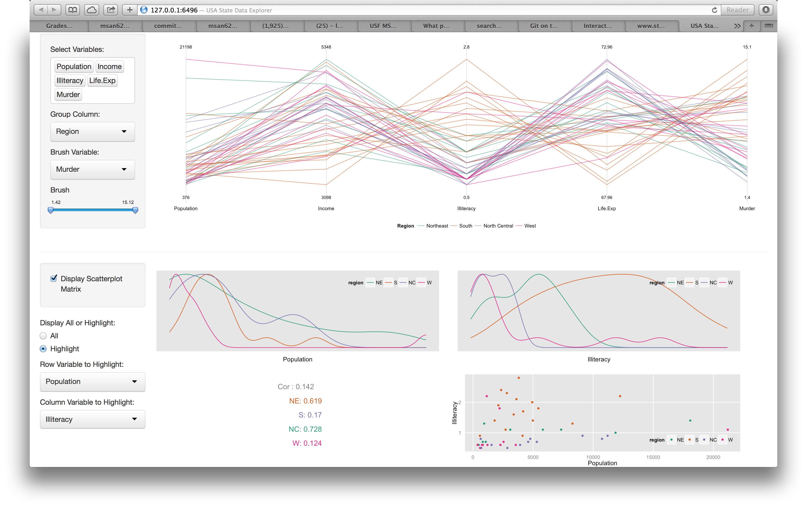

Homework 3: Multivariate
==============================

| **Name**  | Lee Cai  |
|----------:|:-------------|
| **Email** | lcai11@dons.usfca.edu |

Instructions
----------------------

The following packages must be installed prior to running this code:

- `ggplot2`
- `shiny`
- `ggmap`
- `maps`
- `maptools`
- `grid`
- `GGally`
- `plyr`
- `gridExtra`


To run this code, please enter the following commands in R:

```
library(shiny)
shiny::runGitHub('msan622', 'cadancai', subdir='homework3')
```

This will start the `shiny` app. See below for details on how to interact with the visualization.

Discussion 
--------------------

Below is two screenshots of the interface of the shiny app.





## Interaction Description

This shiny application contains four major graphs focusing on presenting multivariate information of the USA state dataset. There are many integrated interactivities in the among the graphs. One reason that I enjoy creating systems is that once the work is done, they are spring to lives. Let's see what you can do.

### The Heatmap.

The heat map is not just a retangular matrix, which could be boring. It's an actual USA map that has 48 states on it. You can filter the heat map by region. You can choose a different fill vairable, so that you can obtain information on the geographical distribution of it. If you don't like the color used in the heatmap, which by default is blue and red for low and high respectively, you have the freedom to change it. It's quite messy to include the state of Hawaii and Alaska, thus I remove these two states from the data.
  
### The Bubble Plot.

The bubble plot is even more powerful. You can control what x variable, y variable, size variable and the color variable at your will and present completely different views in gaining insights. You can choose any states and they will stand out. All other non-chosen states will fade into the background. Very nice!

### The Parallel Coordinate Plot.

In the parallel coordinate plot, you can choose any number of the seven variables provided to be in the plot. You can order them by choose them in a different order. You can also choose the group variable that cluster the lines into different colors. There are two options: Region and Division. More amazing, you can brush the plot. First, you need to choose the variable you want to brush on. Then the total range, consists of the minimum and maximum values of that brush variable will be set to work. It's automatic by using conditional UI! Now go ahead and brush. All lines that fall outside of the range in the Brush of the chosen brush variable will fade to the background, while the qualified ones will be highlighted.

### The Scatterplot Matrix

By default, the scatterplot matrix is not displayed. If you want it, summon it by cliking the display checkbox. It will pop out immediately. The magic happens when you click on the checkbox. Using conditional panel, once the plot is displayed, you will have the option to look at the entire six by six scatterplot matrix, in which the upper triangle is correlations, the diagonal is density plot, and the lower triangle is scatterplots; or you can choose to focus on only one variable or a pair of different variables. Based on you selection, one or four plots will appear in place of the original scatterplot matrix. This is a different implementation of the whole and the details.

### We are not finished! The Interactions!

Watch out, if you dare not touch all the good stuff, you will never find out that the heatmap, the bubble plot, and the parallel coordinate plot are highly interacted. If you choose any combination of the regions in the region filter, the corresponding region will be displayed on the heatmap. At the same time, only those states that belong to this region will display on the bubble plot. Likewise, if you choose any combination of states in the Choose States box, only those chosen states will show up on the heatmap as well. If you select some region in the heatmap filter and some states from the bubble plot, depending on whether the intersection of the two conditions will result in any eligible states, the states will show up on both graphs if any, or nothing shows up but the grey graphs. The heatmap does not interact with the parallel coordinate directly. But the bubble plot does. If you choose any states for the bubble plot, those corresponding lines will be highlighted only in the parallel coordinate plot as well.

## Customization

There are a few things that I have done differently.

- I use a map as the background for the heatmap instead of a retangular matrix. This makes it so much more fun because you now can see the geo-spatial relationship of each state. It's not too difficult, but ideas are ideas. They are important and beautiful when translated.

- I didn't use the ggparcoord function to create the parallel coordinate plot. I did it on my own. After experiencing quite some pains in trying to get the brushing effect using the ggparcoord, I gave up and just implement it myself. In this implementation, I used the 'uniminimax' scale as well, so it's completely the same as what we will get from ggparcoord, except that it's better. Using ggparcoord, you can't (or at least I didn't figure out) freely control the order of the variables. And now we can. By selecting the same set of variables in different order, that is achieved.

- If you didn't get enough, play with the scatterplot matrix. After getting enough overview of the entire matrix, you can 'zoom' in to see each individual as well as pair of variables. There are three different types of graphs: the density plot, the scatter plot, and the correlation plot.

- Some smaller things also worth mentioning. In the parallel coordinate plot, when you choose the brush variable, it doesn't necessarily need to be included in the plot. Also, the range of the slider bar and its initial range will be automatically adjusted based on the range of the selected variable. Last, nested conditional panel can achieve more interaction effects for your application. See what I have done in the scatterplot session!

## About Aesthetics

- The palette used for the plots (except the heatmap) are Dark2. So the color scheme is consistent. The contrast between the highlighted objects and the hidden ones are therefore good.

- It took me quite some time to decide upon such a layout. Since we want to see the interaction of several plots, I don't think use tab panel is a good idea. So all plots are on the same page. If you feel it's too much, you have the choice to ignore the scatterplot matrix. Is it a good idea to hide the first two session when the scatterplot matrix is chosen to be displayed? It's could be either way. And I don't want to hide my hardwork!

- For almost all the graphs, unnecessary pixels are removed as much as possible. So the feeling when looking at the app is fresh and clean.

- I spent a lot of time debugging. If you find any 'bugs', please let me know.

