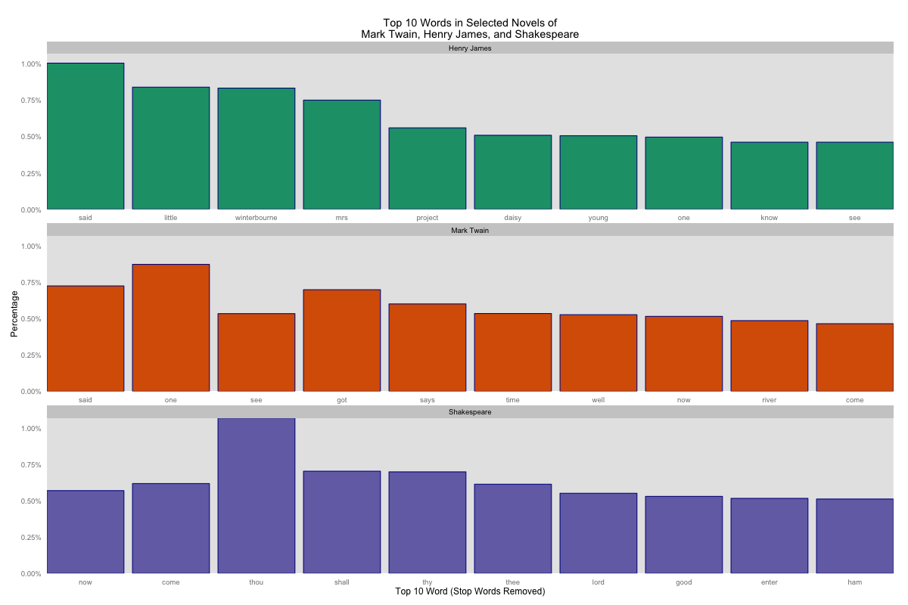
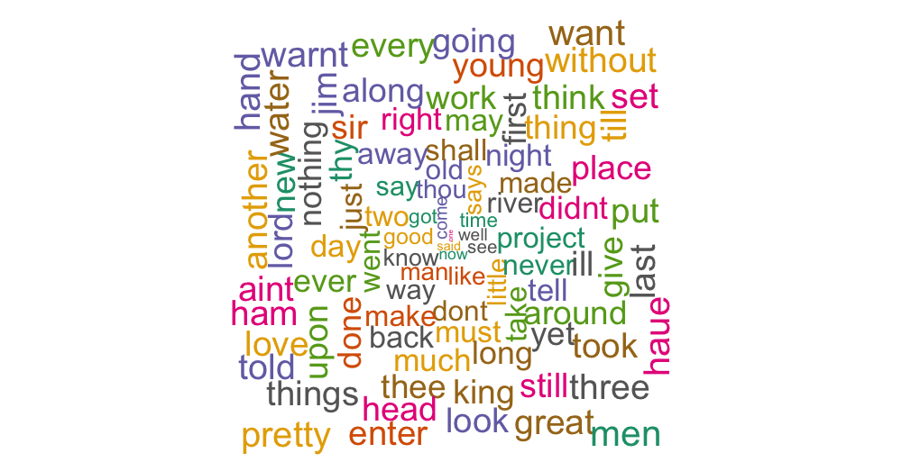
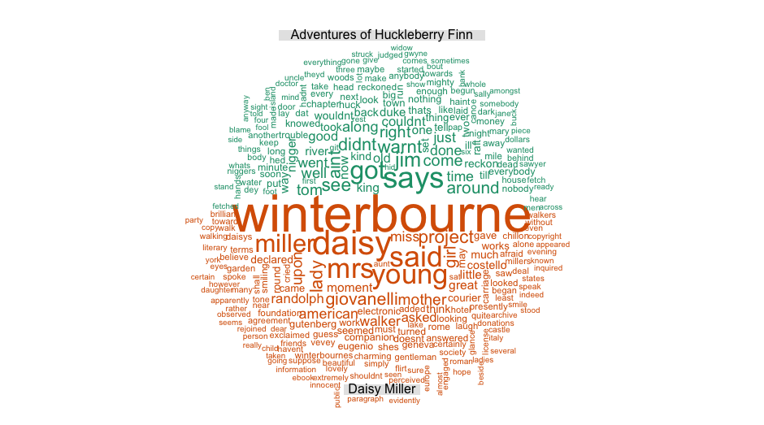
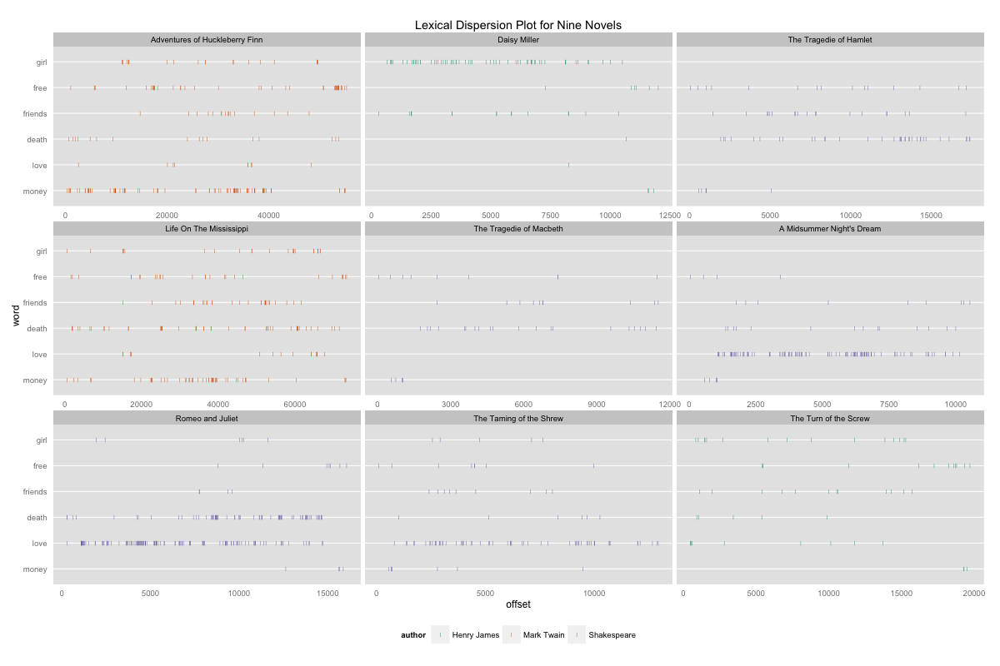

Homework 4: Text Data
==============================

| **Name**  | Lee Cai  |
|----------:|:-------------|
| **Email** | lcai11@dons.usfca.edu |

Instructions
----------------------

The following packages must be installed prior to running the R code:

- `ggplot2`
- `tm`
- `SnowballC`
- `wordcloud`
- `maptools`
- `plyr`
- `scale`
- `reshape`


To run this code, please enter the following commands in R:

```
source('plot.R')
```


Discussion 
--------------------

### Dataset

The dataset that I chose contains 9 novels from three writers: Henry James, Mark Twain, and Shakespeare. There are no special intention of choosing this corpus. I was thinking any text would work fine, but they should be from different source so that comparisons could be made between them from certain perspectives. And in this case, we can compare them among the three writers and/or the nine novels. All these text are obtained from project Gutenberg from the following website: http://www.gutenberg.org. The nine novels are Adventures of Huckleberry Finn, Daisy Miller, The Tragedie of Hamlet, Life On The Mississippi, The Tragedie of Macbeth, A Midsummer Night's Dream, Romeo and Juliet, The Taming of the Shrew, and The Turn of the Screw.

Since I have created four graphs, the dataset that I needed for each graph requires different format. Therefore I have wrapped the transformation needed in three load data functions, from which the wanted datasets are returned. For the bargraph that shows the top ten most frequently used words, I need a dataframe from the term document frequency matrix. The corpus of text was first turned into source and the tm package was used to remove numbers, punctuations, stopwords, and some special words. Some regular expression was also applied to remove some special characters. If I have more time, I would want to write more regular expression to process the text data. Once the above steps are executed, the term document matrix was converted into a dataframe and returned by the function. The word cloud also used this same dataframe. However, since the comparison cloud required the term document matrix, I decided to wrap things into a separate load data function from which the term document matrix is returned. The processing using tm package is exactly the same. Last, for the lexical dispersion plot, I have to know the offsets of each chosen word from the beginning of the document, and I used MC_tokenizer to tokenize each novel, extracted the index of the word in the vector, which is used as the offset. It's not perfectly accurate since for the Shakespeare novels, there are very long meta data text in the beginning of the files. But the graph serves our purpose here.

## Bar Graph

The bar graph is pretty straightforward. It's a small multiple that consists of three bar graphs, each for one writer. It shows the top ten most frequently used words over all the novels that belong to that writer. And I have normalized the counts into percentages, so that the length of the text is adjusted. I didn't adopt stemming. The porter stemming, to me, doesn't work very well in this case. It mistreated a lot of words and I don't see much of gaining from it. Each bar graph is colored based on the authors. It was very difficult to make all three graphs ordered by percentages in decreasing order. So I just leave it there. I used percent formater for the y-axis labels, which makes it look nicer. Redundant information is removed as much as possible, such as the legend. Not sure for the fill color though. Considering ink is very expensive, we may as well sacrifice the good looking color and fill the bars with grey. The top ten words are different among the three writers.



## Word Cloud

The word cloud is visually pleasing to our eyes. And that's the major reason I would ever creat it because it feels cool. Using word cloud package is handy and I don't have much to say. I tried to adjust for the scale and the amount of words I want to put into the cloud.



## Comparison Cloud

The comparison cloud is another format of a word cloud. From the graph below, we are comparing the frequency of the words from the two novels: Adventures of Huckleberry Finn, and Daisy Miller. From this plot, we can see that the most frequent words in Adventures of Huckleberry Finn is more evenly distributed in their frequencies. While in Daisy Miller, the name of the leading roles stood out.



## Lexical Dispersion Plot

The lexical dispersion plot may need some more explanations. I have chosen the six words: girl, free, friends, death, love, and money. I then vectorized all the novels and extract the indice where these words were used and saved them into a data frame together with the novel names and the author. Offset means how many words written before the target word. Each little vertical line represent an occasion of the word, and the x axis is the distance/location from the beginning of the text. We can see that These set of words are used differently by the three authors in different novels. For Mark Twain, all six of the words are used very frequently. What else can you say?



## Discussing about the Lie Factor, Data-Ink Ratio, and Data Density

For all the graphs I have created in this assignment, the lie factor is consistent across them. I believe there is no distortion in the scales for any of the graphs. In the lexical dispersion plot, I did free up the x axis' scale. However, I have tried to fixed it and because all these texts have different length, so the effect is not so good. Essentially we just want to see the dispersion of these chosen words, so even they are not on the same scale, the relative position will still work well for us to see the differences. I have tried to remove as much as possible all the unnecessary inks to raise the data-ink ratio. As for the cloud graphs, I don't know about the effectiveness on this metric. The data density is not very high, so for each graph, it's easy for us to see the information we want. Certainly, the cloud graphs are more for pleasing than for extracting useful information.


## What I have learned from visualizing text data?

The tm package is very powerful and provides the most essential tools for us to process text data. I have familiarized myself with the tm packages. There are many other information about text in addition to the frequency of each term in each text, such as the average length of the words, the length of the sentence, bi-grams and N-grams preserve the order of the words and should be treated differently. Other things may include similarities, clustering and classifications. I hope to use text data for those analysis in the coming time as well. Also, the word cloud package is more powerful than what we have learned so far.


