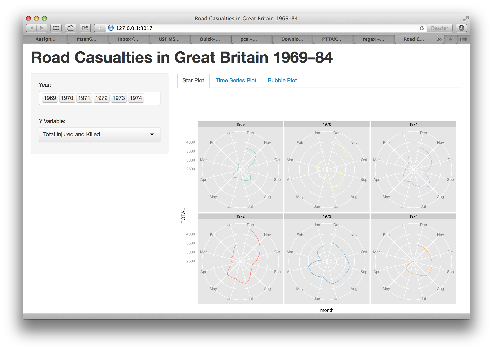

Homework 5: Time Series
==============================

| **Name**  | Lee Cai  |
|----------:|:-------------|
| **Email** | lcai11@dons.usfca.edu |

Instructions
----------------------

The following packages must be installed prior to running this code:

- `ggplot2`
- `shiny`
- `reshape`
- `zoo`


To run this code, please enter the following commands in R:

```
library(shiny)
shiny::runGitHub('msan622', 'cadancai', subdir='homework5')
```

This will start the `shiny` app. See below for details on how to interact with the visualization.

Discussion 
--------------------

Below are three screenshots of the interface of the shiny app.




## Interaction Description

In this shiny application, given the UK road casualities data from 1969-1984, I attempted to present as thoroughly as possible all different views from it. All the information was centered around the intrinsic relationship on time. The interaction is not highly complicated, but each plot does serve a different purpose. Animation were added to two of the three techniques among other possible interactivity such as filtering. Let's see more details from below.

### The Star Plot

The star plot is simple and new in the sense that I didn't get to use it very much, so this is the only motivation. The polar coordinate system makes it easier to see the the outwardness in deviating from a circle shape. Therefore it's also quite clear to see the seasonal pattern. What you see will actually depend on which Y variable you are selecting. For example, if you choose the total driving distance, you will notice that for all these road accidents that happened in UK during those years, regardless of the casualities, people always drove more in the summer time (in particular, July and August). Also, from these views, you will see that over time the total distance is also increasing. In short, you can see trends using this view! Since you have the flexibility to choose from any of the variables in the dataset, you actually get to see a lot! Choose one variable and try to interpret the views yourself and have fun. You can also choose as many years' data as you want.

### The Time Series Plot

The time series plot consists of two components, the overview and the detailed view. The two components interact with each other so that you can have a high level view while not missing the details too. As we know from the data, there are two sets of information. The first set of variables include drivers that got injured and killed, front passengers as well as rear passengers that got injured and killed. Sum them up you will get the total number of people that got injured and killed. The second set of variables include people got killed in accidents and those drivers who got killed while driving vans. So these two variables are only looking at people who died in these road accidents. Supporting the idea of building an app that gives you as many different views as possible, you have the choices to switch between these two sets of information. We see from the plot that most of the casualities came from drivers. Notice that after the 1983 seatbelt law was executed, the casualities dropped for about one year and then slowly climbed back up again. It could be that new hazard/bad hibits formed again over time, or cars became more advanced and with higher speeds, or simply the number of drivers and car owners increased. But the actual reason needs to be further explored with additional data. If you hit the little triangle button, then you will have the animation. To adjust for the detail view, you can choose the range by setting number of months as well.

### The Bubble Plot

The bubble plot is quite fun to watch and play around. You can choose from a list of size variables. The x axis is petroleum price, the y axis is total distance travelled for all accidents that caused casualities. There is the time dimension in years. Each point shows up on the plot represents a data point in a certain month with different color for a different month. One can choose to display only certain months with labels or not. At last, you can play the animation and look at the changes of size and location of each data point over years. Since we have observed some seasonal effect in the data, it makes sense to compare the data in the same month over time.

### Discussing the lie-factor, data ink ratio and data density

There is no distortion in all views, therefore the lie-factor should be 1. The detailed view of the time series plot used stacked area plot, therefore the data ink would be lowered. Other than that, the data ink ratio should be high. The data density is decent (not too dense, but reasonably informative).

## Customization

What is unique and special about my shiny app? I really tried to emcompass as many views as possible. Each plot is just providing the essential interactivities to just enable doing that. There are some little touches here and there. For the time series overview, I change the color of the data after the seatbelt law was implemented. So we were able to observe the impact of imposing a law brought on the casualties immediately. In the time series plot, two statistics, namely the Killed and Injured statistc and the Killed only statistic are available. Lastly, mimicking the famous gap minder visualization, I made the years as an addtional dimension to look at the data changing over time.

## About Aesthetics

- For the layout, each plot has its own control side bar panel so the structure of the app is crystal clear to users.

- For almost all the graphs, unnecessary pixels are removed as much as possible. So the feeling when looking at the app is fresh and clean.

- Haven't spent time to figure out how to merge January and December in the star plot, but I feel it's actually ok to leave it as it is right now. It's interesting to see that the casualties in winter is higher than other times. Is this because of the wheather?


