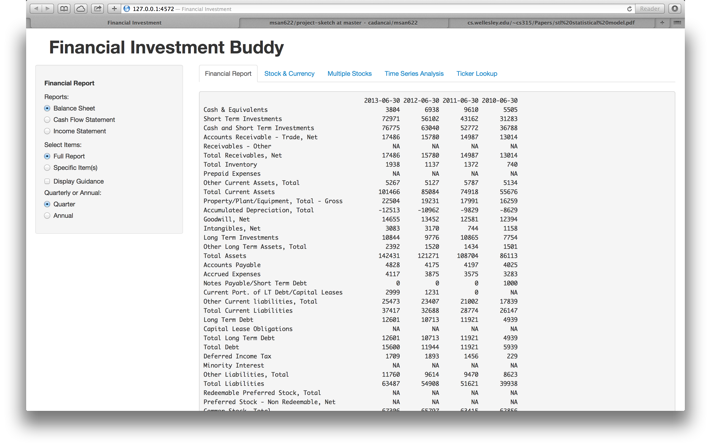
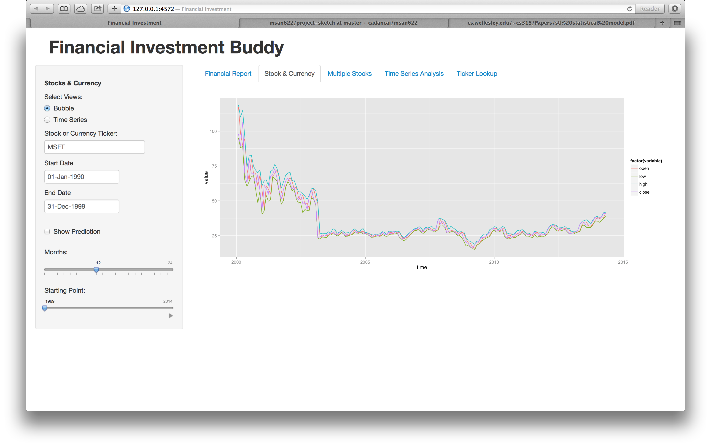
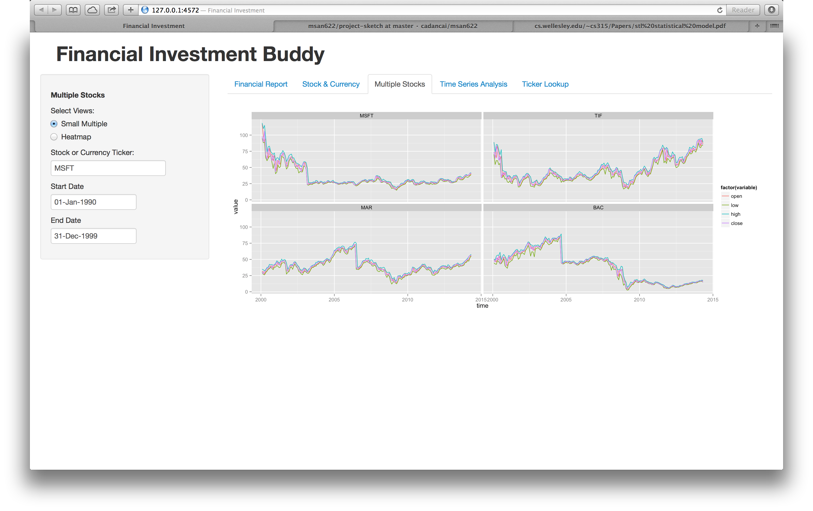
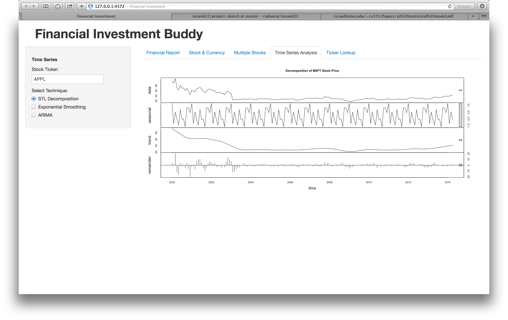

Project Prototype: Financial Investment Buddy
==============================

| **Name**  | Lee Cai  |
|----------:|:-------------|
| **Email** | lcai11@dons.usfca.edu |

Instructions
----------------------

The following packages must be installed prior to running this code:

- `ggplot2`
- `shiny`
- `reshape`
- `zoo`
- `plyr`
- `scales`
- `quantmod`
- ``


To run this code, please enter the following commands in R:

```
library(shiny)
shiny::runGitHub('msan622', 'cadancai', subdir='project-prototype')
```

This will start the `shiny` app. See below for details on how to interact with the visualization.


Discussion 
--------------------

Below are three screenshots of the interface of the shiny app.









## Data Set

I choose to use quantmod to retrieve data from yahoo finance. All the data that I will be working with is either the stock price for different companies and/or exchange rate. Also we will be able to look also at the financial reports for the chosen stocks.

My biggest motivation in choosing these datasets is their real-time availability from yahoo finance. This means the app that I will be developing will never go out of date. Regarding the complexity of the data, there is not much to say. The user will have the freedom to look at different aspects of a stock, its predictions into the futures at different time units, and some deeper analysis on each stock. At the same time, the financial report that accompanied the stock will also provide a window for investors to understand better about the real situation of the companies and their decision on investment will be more solid. One can also compare across multiple stocks. There are a lot of flexibilities. And the best way to understand the app is to use it once it's completed.

## Techniques

I will try to use as many techniques as possible, as long as it's making sense with the data. After all, what's the point if something is not making sense but only for the purpose of being existence.

The techniques that are being considered at this point include simple time series plot, bubble plot, small multiples, and heatmap. There will be plots that are produced from modeling. The modeling techniques being considered include STL decomposition, Exponential Smoothing, and ARIMA models.

Last, I will implement a search engine for lookup of the tickers for stocks and currencies. Remember, we have similar views for exchange rates between different pair of currencies. There are many more possibilities, such as to include data for index, future, mutual funds. They could be enabled in the future.

## UI

The user interface right now is a little disorganized and big reorganizations will be made to structure the user interface. The essential idea is to create different control panel for each view so there will be no confusion. I will expect myself using a lot of conditional panels. I have to emphasize that the challenges lie in harnessing and munging the data to the right format. The second most challenging part is to design a good organization for all this available information from such a rich data. There is some learning curve in mastering how to use the quantmod package.

## Summary

So far, the prototype is still static and far from being the final version. And I would really appreciate inputs from everyone regarding how I should organize the views and the controls.


