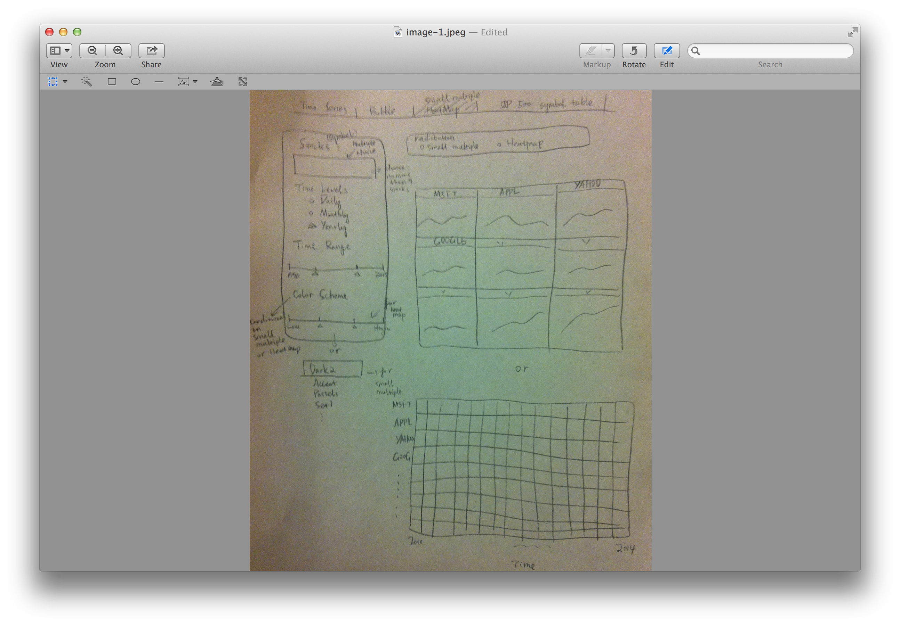

Project Sketch 
==============================

| **Name**  | Lee Cai  |
|----------:|:-------------|
| **Email** | lcai11@dons.usfca.edu |

Data
----------------------

I settle down in using the R package quantmod to extract stock/finance data from Yahoo Finance in real time. So far to the best of my knowledge, the stock price (including the low, high, average, and closing prices) on different time level (daily, monthly, and yearly), the trading volumes, and many other meta infromation of the company and their stocks are available for download. The cool thing about choosing this dataset is its real time updates. This will make my shiny app never becomes outdated. And the users can choose any stocks from the S&P 500 list and view the information they want.

Sketch of Final Project:
----------------------

The first view consists of a time series plot. I plan to implement this time series plot with an overall view and a zoom in view. One can slide the Zoom slider to zoom in and see the stock prices in that chosen time window in higher granularity.

The second view has a bubble plot on it. The most outstanding interactivity is its gap minder like pseudo-animation. We will see the changes in trade and the volatility of the stocks over time by playing the views at different time point. I also plan to apply some time series technique in predicting future stock values with given confidence interval. In the first view, I may choose to add a separate table for the predictions at the bottom of the graphs if requested for display.

The third view has two components: a small multiple time series plot and a heatmap. They won't show up at the same time. One can choose which graph they want to look at. Up to 9 stocks can be chosen to each of the two graphs.

As a guidance for user, I will include a S&P 500 stocks symbol table in a separate tab so that users can look up for the stocks they want to view and check out their symbols. These symbols will be sorted alphabetically.

Planned Tools
-------------------
The tools that will be used include but not limited to shiny, ggplot2, quantmod and many other R data munging and statistical packages. 

Planned Techniques
--------------------
The four techniques that are going to be used include time series plot, bubble plot, heatmap, and small multiple plot.

Planned Interactions
---------------------
Each view will have a conditional sider bar panel based on which tab the user is currently viewing. Between different views, there is no direct interactions. Therefore each view is relatively independent of each other. The interactions that will be employed include filtering, zooming, animations like the gap minder, brushing in heatmap color scheme. For the S&P 500 symbol table, see if I can implement some searching engine like functionality by using Levenshtein distance. It would be a lot of fun to do that.

Planned Interface
----------------------
The interface of the shiny app is in the format of tabset panel with side bar and main panel under each tab. Each side bar associated with different views will have multiple input formats to interact with users. Please see the above sketches for more visualized information.

